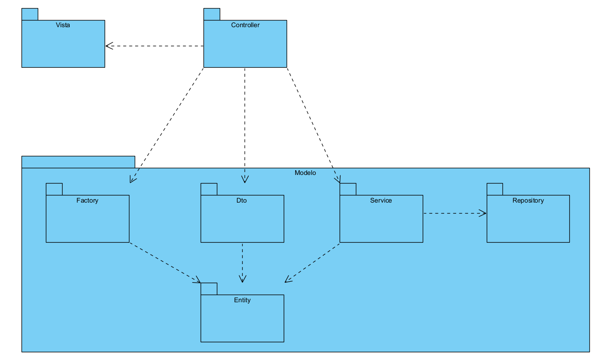

Diagrama de arquitectura

Este diagrama representa cómo se aplicó la arquitectura de MVC al sistema. Esta propuesta busca lograr una aplicación robusta y flexible a cambios y modificaciones. Las capas del modelo, que son Service, Repository, DTO y Factory, promueven una alta cohesión dentro de cada componente y un bajo acoplamiento entre ellos, lo cual facilita el mantenimiento, testing y crecimiento del sistema a largo plazo.

La razón por la que se implementó este patrón es porque al dividir el sistema en estas tres partes, de manera fácil se puede aislar la lógica de presentación, la lógica de flujo y control y la lógica de negocio y persistencia. Esto permite que se puedan realizar cambios en una capa sin afectar directamente a las otras, lo cuál buscábamos desde un principio pero con este patrón lo pudimos realizar de una manera más fácil, a diferencia de otras arquitecturas como la N-capas. También obtenemos otras ventajas como probar individualmente los componentes desacoplados y desarrollar un crecimiento en el sistema mediante nuevas funcionalidades sin romper las ya existentes. 

Una explicación breve de qué hacían estos paquetes sería:

Vista: Representa la capa de presentación, encargada de interactuar con el usuario. Esta capa comunica sus acciones al Controller y recibe respuestas o actualizaciones que mostrar.

Controller: Actúa como intermediario entre la Vista y el resto del sistema. Recibe solicitudes del usuario, gestiona la lógica de flujo y delega el trabajo a la capa Service. También transforma datos entre entidades y DTOs cuando es necesario.

Service: Contiene la lógica de negocio de la aplicación. Esta capa orquesta operaciones complejas, realiza validaciones y coordina el acceso a los datos a través de la capa Repository.

Repository: Encapsula el acceso a la base de datos o fuente de persistencia. Esta capa define interfaces o clases que permiten almacenar, recuperar, actualizar y eliminar entidades sin exponer detalles de implementación.

Entity: Contiene las clases que modelan el dominio de la aplicación. Estas entidades suelen corresponder a tablas de base de datos y representan los objetos reales con los que trabaja el sistema (por ejemplo: Mascota, Usuario, SolicitudAdopcion, etc.).

Dto (Data Transfer Object): Facilita el transporte de datos entre capas, especialmente entre el Controller y la Vista, o entre el Controller y la Service. Esto ayuda a desacoplar las entidades del modelo de dominio de la lógica de presentación.

Factory: Este paquete encapsula la creación de objetos complejos, especialmente entidades. Esto promueve la reutilización de código y centraliza la lógica de inicialización, facilitando cambios futuros y pruebas.

