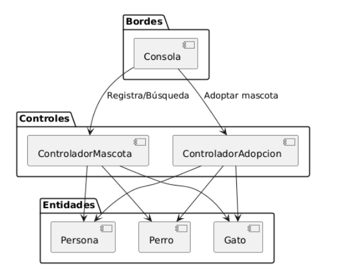

Diagrama de Análisis basado en el modelo Entidad–Borde–Control (EBC)

Este patrón arquitectónico tiene como objetivo principal promover una clara separación de responsabilidades, facilitando así la mantenibilidad, escalabilidad y claridad del sistema.

Descripción General

El sistema se encuentra organizado en tres capas fundamentales, cada una de ellas orientada a un conjunto específico de responsabilidades:

•	Bordes (Interfaces): Encargados de gestionar la interacción entre el usuario y el sistema.

•	Controles (Controladores): Responsables del procesamiento de la lógica de negocio.

•	Entidades: Representaciones puras de los datos relevantes del dominio.

1. Capa de Borde

Elemento Principal:

•	Consola

Descripción:

La Consola actúa como la única interfaz de usuario disponible en el sistema. Su función consiste exclusivamente en recibir comandos e información del usuario, así como en mostrar resultados o mensajes de respuesta provenientes de las capas de control.

Responsabilidades específicas:

•	Capturar acciones del usuario, tales como registrar una mascota, buscar mascotas disponibles o solicitar la adopción de un animal.

•	Enviar las solicitudes de procesamiento a los controladores correspondientes (ControladorMascota o ControladorAdopcion).

•	Mostrar información procesada, evitando involucrarse en la lógica de negocio o manipular directamente las entidades.

Interacción:

•	Registro y búsqueda de mascotas: mediante comunicación con el ControladorMascota.

•	Adopción de mascotas: a través del ControladorAdopcion.

La Consola se limita estrictamente a funciones de entrada y salida, manteniendo una completa separación respecto a la lógica de negocio.

4. Capa de Control

Elementos Principales:

•	ControladorMascota

•	ControladorAdopcion

Descripción:

La capa de Control contiene los componentes encargados de interpretar las acciones del usuario, aplicar la lógica de negocio y coordinar la interacción con las Entidades.

2.1 ControladorMascota

Responsabilidades:

•	Registrar nuevas mascotas en el sistema.

•	Consultar o buscar mascotas en función de criterios específicos.

•	Gestionar instancias de las entidades Perro y Gato.

Funciones:

•	Validar los datos recibidos desde la Consola antes de crear nuevas mascotas.

•	Listar mascotas disponibles u ofrecer filtros de búsqueda por características.

2.2 ControladorAdopcion

Responsabilidades:

•	Gestionar todo el proceso de adopción de mascotas.

•	Verificar que las mascotas estén disponibles para adopción.

•	Asociar mascotas con adoptantes representados mediante la entidad Persona.

Funciones:

•	Validar las condiciones de adopción (por ejemplo, evitar la adopción de mascotas ya adoptadas).

•	Actualizar el estado de las mascotas tras una adopción exitosa.

Hay que tener en cuenta que los controladores son los únicos responsables de acceder directamente a las Entidades. La Consola no interactúa de forma directa con estas.

6. Capa de Entidades

Elementos Principales:

•	Persona

•	Perro

•	Gato

Descripción:
Las Entidades representan modelos de datos dentro del sistema. Estas clases contienen atributos esenciales que describen los objetos principales del dominio, sin incluir lógica de negocio compleja.

3.1 Persona

Atributos:

•	Nombre

•	Id

•	Dirección

•	Correo

•	 Contraseña

•	Teléfono

Descripción:

Representa a los usuarios que pueden adoptar mascotas.

3.2 Perro

Atributos:

•	Nombre

•	Especie

•	Edad

•	Sexo

•	Descripción

•	fechaRegistro

Descripción:

Representa a las mascotas disponibles en el sistema.

3.3 Gato

Atributos posibles:

Tiene los mismos atributos que Perro.

Descripción:

Representa a las mascotas de tipo gato registradas en el sistema.

Principio fundamental:

Las entidades son utilizadas exclusivamente por los controladores, y no por la Consola, garantizando así una correcta separación de responsabilidades y minimizando el acoplamiento.

Beneficios del Modelo EBC aplicado

•	Alta cohesión: Cada componente posee una responsabilidad única y bien definida.

•	Bajo acoplamiento: Las capas interactúan únicamente mediante interfaces bien establecidas, reduciendo la dependencia mutua.

•	Facilidad de mantenimiento: Cualquier cambio en la lógica de negocio o en las reglas de datos puede realizarse en la capa correspondiente, sin afectar al resto del sistema.

•	Escalabilidad: Permite la incorporación de nuevas funcionalidades o interfaces (por ejemplo, una interfaz gráfica) sin necesidad de reestructurar completamente el sistema.

Conclusiones

El modelo Entidad–Borde–Control (EBC) implementado garantiza una arquitectura sólida, modular y fácilmente extensible. Gracias a la estricta separación de responsabilidades entre la Consola, los Controladores y las Entidades, el sistema puede adaptarse a cambios futuros con un mínimo esfuerzo, promoviendo buenas prácticas de ingeniería de software.
