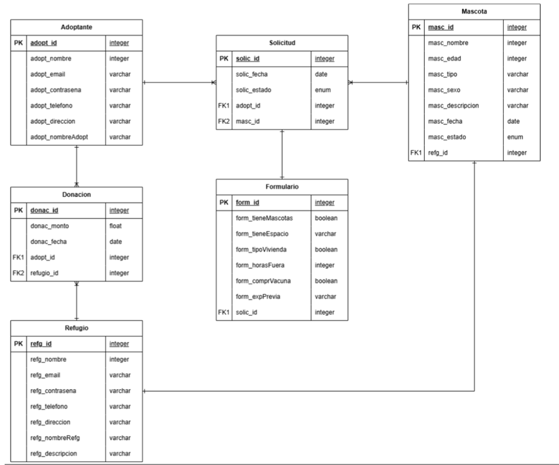

Este modelo entidad-relación fue diseñado con el objetivo de representar de forma estructurada y coherente los datos necesarios para la gestión de un sistema de adopción de mascotas. La base de datos busca garantizar integridad referencial, claridad en las relaciones entre entidades, y una escalabilidad que permita futuras ampliaciones del sistema sin comprometer la consistencia de los datos.

Entidades principales
1.	Adoptante
Representa a los usuarios interesados en adoptar una mascota. Almacena datos personales esenciales como nombre, correo, dirección y teléfono. La entidad está relacionada directamente con las solicitudes de adopción y las donaciones.
2.	Mascota
Contiene la información de los animales disponibles para adopción. Se incluyen atributos como nombre, edad, tipo, sexo y estado de adopción. Cada mascota está asociada a un refugio, lo cual se modela mediante una clave foránea.
3.	Solicitud
Representa el registro de intención de adopción por parte de un adoptante hacia una mascota. Permite registrar el estado del proceso (pendiente, aprobada, rechazada, etc.). Su relación con las entidades Adoptante y Mascota refleja que cada solicitud está vinculada a una única combinación adoptante-mascota.
4.	Formulario
Extiende el detalle de la solicitud mediante preguntas clave sobre las condiciones del adoptante. Esto ayuda a evaluar la idoneidad del solicitante. Está ligado a una solicitud específica, representando una relación 1:1.
5.	Refugio
Representa a las instituciones encargadas del resguardo y administración de mascotas. Cada refugio puede recibir donaciones y tener varias mascotas a su cargo.
6.	Donación
Permite registrar contribuciones económicas realizadas por los adoptantes. Estas donaciones están asociadas tanto a un adoptante como a un refugio, permitiendo identificar el origen y destino del apoyo financiero.

Relaciones
•	Adoptante-Solicitud,Adoptante-Donación
Representan relaciones 1:N, dado que un mismo adoptante puede generar múltiples solicitudes y donaciones.
•	Mascota-Solicitud
Permite registrar múltiples solicitudes por una misma mascota, lo cual es útil cuando hay alta demanda por un animal en particular.
•	Solicitud-Formulario
Se establece una relación 1:1 para garantizar que cada solicitud tenga un único formulario de evaluación.
•	Mascota-Refugio
La relación entre mascotas y refugios asegura trazabilidad sobre su procedencia.
•	Refugio-Donación
Define el destino de las donaciones, clave para la transparencia del sistema.

Este diagrama fue diseñado siguiendo principios de normalización con el fin de evitar redundancia de datos y garantizar la integridad referencial, lo que permite mantener una base de datos limpia, coherente y eficiente. La estructura permite una alta escalabilidad, facilitando la incorporación de nuevas funcionalidades, como el seguimiento post-adopción o la generación de reportes detallados sobre donaciones, sin necesidad de modificar la estructura central del esquema. Además, la disposición de las relaciones entre entidades clave —como adoptantes, mascotas, refugios y solicitudes— ofrece una trazabilidad clara y precisa, permitiendo identificar con facilidad quién adoptó a qué mascota, desde qué refugio provino, bajo qué condiciones se realizó la adopción y qué formularios la respaldaron. Esta organización no solo optimiza el acceso y análisis de los datos, sino que también refuerza la transparencia del sistema en su conjunto.

