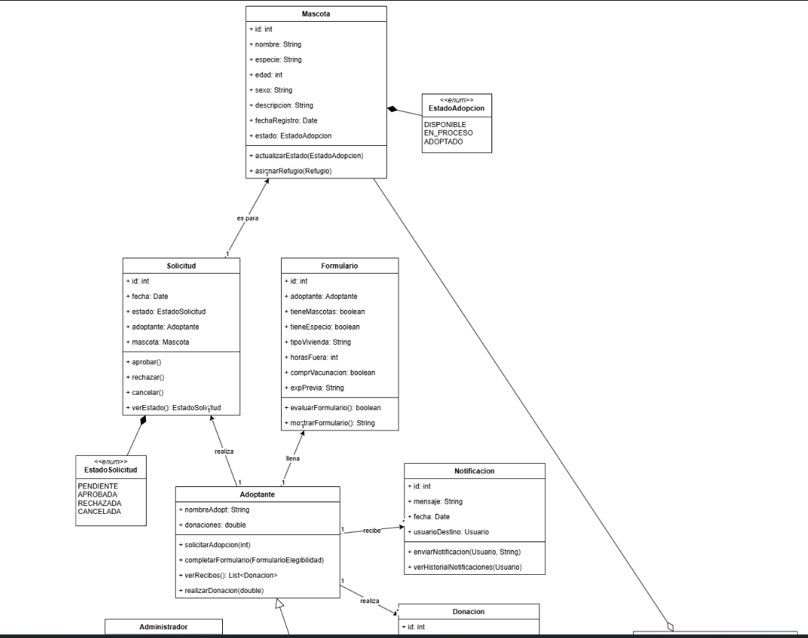
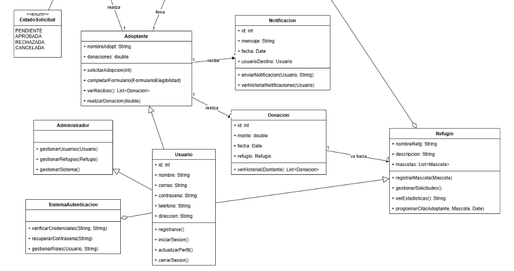

Diagrama de Clases

Descripción general
El diagrama de clases modela la estructura fundamental del sistema de adopción y donación de mascotas. A través de la representación de clases, atributos, métodos y relaciones entre entidades, se refleja la lógica de negocio que rige el proceso de adopción, desde el registro de un usuario hasta el seguimiento postadopción.
La estructura captura las siguientes categorías principales:

•	Usuarios y sus diferentes roles: Adoptante, Refugio y Administrador.

•	Gestión de mascotas y solicitudes de adopción.

•	Formularios de elegibilidad para evaluar adoptantes.

•	Seguimiento de mascotas tras la adopción.

•	Autenticación y notificaciones del sistema.

Clases Principales y Detalle de Responsabilidades

1. Usuario

Clase abstracta que sirve como base para todos los usuarios del sistema.

Atributos principales:

•	idUsuario

•	nombre

•	correo

•	contraseña

• telefono

Métodos:

•	registrar()

•	iniciarSesion()

•	actualizarPerfil()

Descripción: Todos los tipos de usuarios (Adoptante, Refugio, Administrador) heredan de esta clase. Implementa funcionalidades comunes como registro, inicio de sesión y actualización de datos personales.

2. Adoptante (hereda de Usuario)

Es un tipo especializado de usuario que desea adoptar mascotas.
Atributos adicionales:

•	direccion

•	documentoIdentidad

Métodos:

•	solicitarAdopcion()

•	completarFormularioElegibilidad()

•	realizarDonacion()

Descripción: El adoptante puede buscar mascotas, llenar formularios para validar su elegibilidad, solicitar adopciones y realizar donaciones a refugios.

3. Refugio (hereda de Usuario)

Entidad que ofrece mascotas para adopción.

Atributos adicionales:

•	nombreRefugio

•	ubicacion

•	descripcionRefugio

Métodos:

•	registrarMascota()

•	gestionarSolicitudes()

•	programarCitas()

Descripción: El refugio puede subir mascotas al sistema, administrar las solicitudes de adopción que recibe y coordinar citas para adopciones presenciales o virtuales.

4. Administrador (hereda de Usuario)

Usuario que administra el sistema.

Atributos adicionales:

•	nivelAcceso

Métodos:

•	gestionarUsuarios()

•	supervisarRefugios()

•	auditarSistema()

Descripción: El administrador tiene control sobre todos los elementos del sistema: puede gestionar cuentas, aprobar o eliminar usuarios y refugios, además de supervisar la actividad general.

5. Mascota

Representa a una mascota que puede ser adoptada.

Atributos:

•	idMascota

•	nombre

•	especie

•	raza

•	edad

•	estadoSalud

•	descripcion

•	estadoAdopcion (Disponible, Adoptada, En Proceso)

Métodos:

•	actualizarEstado()

•	modificarInformacion()

Descripción: Cada mascota tiene atributos básicos de identificación y estado de salud. El refugio puede actualizar su información y estado en cualquier momento.

6. SolicitudAdopcion

Representa una solicitud hecha por un adoptante para una mascota específica.

Atributos:

•	idSolicitud

•	fechaSolicitud

•	estadoSolicitud (Pendiente, Aprobada, Rechazada)

•	comentarios

Métodos:

•	evaluarSolicitud()

•	actualizarEstadoSolicitud()

Descripción: Es el registro de la intención de adopción. Su evaluación involucra la validación del formulario de elegibilidad y la decisión por parte del refugio.

8. FormularioElegibilidad

Cuestionario que el adoptante debe completar para ser evaluado.

Atributos:

•	idFormulario

•	preguntas

•	respuestas

•	resultadoEvaluacion (Apto/No apto)

Métodos:

•	evaluarFormulario()

Descripción: Es utilizado para asegurar que el adoptante cuenta con las condiciones adecuadas para la tenencia responsable de una mascota.

9. SeguimientoPostAdopcion

Controla el bienestar de la mascota luego de su adopción.

Atributos:

•	idSeguimiento

•	fechaSeguimiento

•	comentarios

•	estadoMascota

Métodos:

•	registrarVisita()

•	actualizarEstado()

Descripción: Permite que el refugio o una entidad de seguimiento verifique periódicamente el estado de la mascota en su nuevo hogar.

10. Autenticacion

Módulo dedicado a la verificación de identidad de los usuarios.

Atributos:

•	tokenSesion

•	rolUsuario

Métodos:

•	verificarCredenciales()

•	asignarRol()

Descripción: Gestiona el inicio de sesión y la persistencia de sesiones seguras, así como la asignación de roles basados en el tipo de usuario.

11. Notificacion

Permite enviar mensajes y alertas a los usuarios.

Atributos:

•	idNotificacion

•	mensaje

•	fechaEnvio

•	tipoNotificacion (Adopción, Recordatorio, Rechazo, etc.)

Métodos:

•	enviarNotificacion()

•	leerNotificacion()

Descripción: Se utiliza para mantener informado al usuario sobre el estado de solicitudes, citas programadas, resultados de formularios, entre otros.

Relaciones entre Clases

•	Generalización (Herencia): 
  
  o	Adoptante, Refugio, y Administrador heredan de Usuario.
•	Asociaciones:
  
  o	Mascota tiene una relación de propiedad con Refugio.
  
  o	Adoptante puede crear una o varias SolicitudAdopcion.
  
  o	Cada SolicitudAdopcion está relacionada con una Mascota.
  
  o	Cada SolicitudAdopcion está vinculada a un FormularioElegibilidad.
  
  o	Una vez adoptada una mascota, puede tener uno o varios registros de SeguimientoPostAdopcion.
  
  o	Autenticacion está asociada a Usuario.
  
  o	Notificacion puede estar asociada a cualquier tipo de Usuario.
•	Cardinalidad típica:
  
  o	Un Adoptante puede realizar varias SolicitudesAdopcion.
  
  o	Una Mascota puede estar asociada a cero o una SolicitudAdopcion activa.
  
  o	Un Refugio puede registrar múltiples Mascotas.

Con este diseño de clases logramos construir una base clara y organizada para el sistema de adopción y donación de mascotas. Cada componente cumple un rol bien definido, permitiendo que los procesos de registro, solicitud, evaluación y seguimiento se realicen de manera sencilla y estructurada. El hecho de separar las funciones por tipo de usuario, junto con módulos específicos para la autenticación, las notificaciones y el seguimiento postadopción, hace que el sistema sea fácil de mantener, seguro y escalable a futuro. Este diseño no solo facilita la implementación técnica, sino que también responde a las necesidades reales de un ecosistema de adopción digital moderno, garantizando bienestar tanto para las mascotas como para sus adoptantes.
