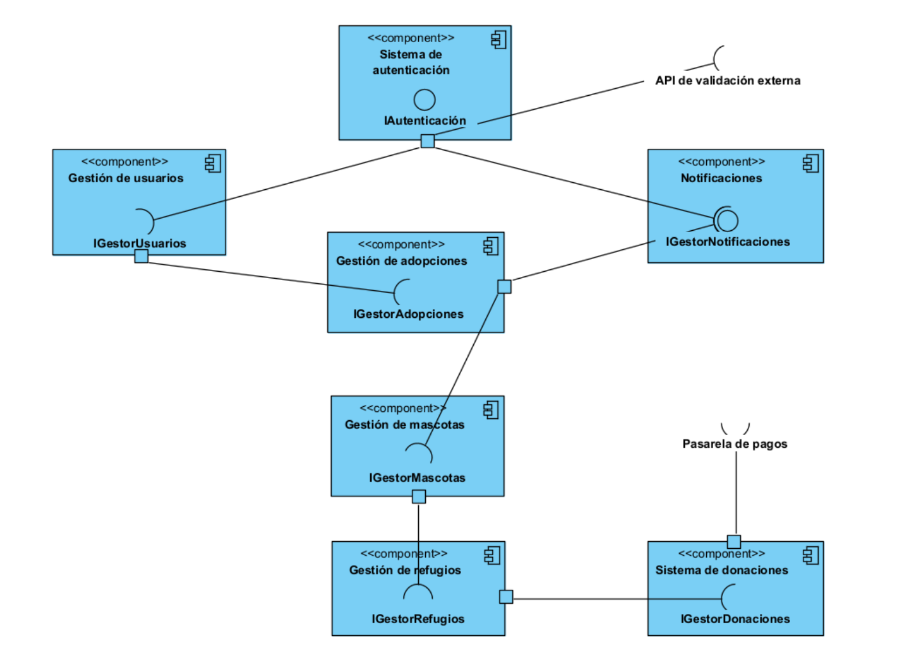

Diagrama de Componentes

Este diagrama ilustra la arquitectura del sistema dividida en múltiples componentes autónomos, siguiendo un enfoque basado en responsabilidades bien definidas. Cada componente encapsula una funcionalidad específica y se comunica con otros componentes a través de interfaces bien establecidas, promoviendo así la modularidad, el desacoplamiento y la escalabilidad del sistema.

1. Sistema de Autenticación (IAutenticacion)
•	Responsabilidad: Validar las credenciales de los usuarios que desean ingresar al sistema.

•	Integraciones externas: Este componente se comunica directamente con una API de validación externa, lo que permite delegar el proceso de autenticación en servicios especializados.

•	Relaciones:

o	Proporciona servicios de autenticación al componente de Gestión de usuarios y al de Gestión de adopciones, asegurando que solo usuarios autenticados interactúen con el sistema.

2. Gestión de Usuarios (IGestorUsuarios)

•	Responsabilidad: Administrar toda la información relacionada con los usuarios del sistema, incluyendo creación, edición, consulta y eliminación de cuentas.

•	Relaciones:

o	Se autentica a través del Sistema de Autenticación.

o	Colabora con el módulo de Gestión de adopciones, permitiendo asignar usuarios a procesos de adopción.

o	Puede generar eventos que desencadenan notificaciones a través del componente de Notificaciones.
3. Gestión de Adopciones (IGestorAdopciones)
•	Responsabilidad: Gestionar todo el ciclo de vida de una adopción de mascotas, desde la solicitud inicial hasta la finalización del proceso.

•	Relaciones:

o	Depende de la validación previa de usuarios a través de IAutenticacion.

o	Interactúa con el componente de Gestión de Mascotas para verificar la disponibilidad y características de las mascotas en adopción.

o	Dispara eventos en el componente de Notificaciones para informar cambios de estado en el proceso de adopción.

4. Gestión de Mascotas (IGestorMascotas)

•	Responsabilidad: Administrar el catálogo de mascotas disponibles en el sistema, incluyendo el registro, actualización y consulta de información sobre perros, gatos, u otras especies.

•	Relaciones:

o	Es utilizado por el módulo de Gestión de adopciones para consultar mascotas disponibles.

o	Se comunica con Gestión de refugios para asociar mascotas a refugios físicos donde están alojadas.

5. Gestión de Refugios (IGestorRefugios)

•	Responsabilidad: Mantener información actualizada de los refugios participantes en el sistema, como ubicación, capacidad y mascotas alojadas.

•	Relaciones:

o	Trabaja en conjunto con Gestión de Mascotas para administrar qué mascotas pertenecen a qué refugio.

o	Colabora también con el Sistema de donaciones, al recibir recursos que ayudan al mantenimiento de los refugios.

6. Sistema de Donaciones (IGestorDonaciones)

•	Responsabilidad: Gestionar las donaciones económicas realizadas hacia los refugios del sistema.

•	Integraciones externas: Se conecta con una pasarela de pagos externa para procesar las transacciones de manera segura.

•	Relaciones:

o	Relaciona las donaciones recibidas con los refugios registrados en el componente de Gestión de Refugios.

7. Notificaciones (IGestorNotificaciones)

•	Responsabilidad: Enviar alertas y notificaciones automáticas a los usuarios del sistema cuando ocurren eventos relevantes, como la aprobación de una adopción o actualizaciones en su perfil.

•	Relaciones:

o	Se integra con los componentes de Gestión de usuarios y Gestión de adopciones para recibir eventos y generar las notificaciones correspondientes.

Beneficios de esta arquitectura:

•	Modularidad: Cada funcionalidad principal está encapsulada en un componente independiente, facilitando el mantenimiento y la evolución del sistema.

•	Escalabilidad: Nuevos componentes o extensiones (por ejemplo, nuevos tipos de notificaciones o métodos de pago) pueden integrarse de forma sencilla.

•	Desacoplamiento: Las dependencias entre componentes son mínimas y están bien definidas, permitiendo un desarrollo paralelo y la posibilidad de sustituir componentes individuales sin afectar el resto del sistema.

•	Claridad: El flujo de información es explícito y controlado, haciendo más fácil entender el sistema y localizar errores.
