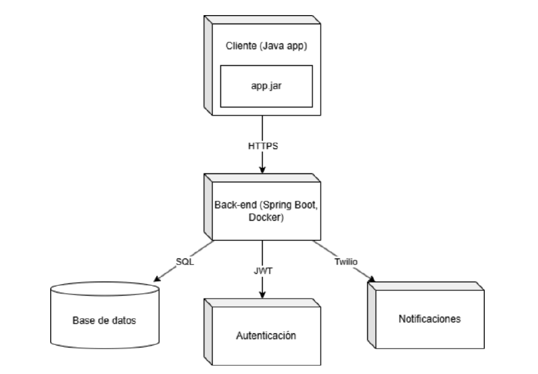

El cliente corresponde a una aplicación desarrollada en Java, ya que es un lenguaje robusto, multiplataforma y orientado a objetos, lo cual facilita el desarrollo y mantenimiento de la aplicación. Esta se comunica con el back-end a través del protocolo HTTPS, garantizando la transmisión cifrada de los datos sensibles de los usuarios y las mascotas. El back-end está construido con Spring Boot porque permite desarrollar aplicaciones web de manera rápida, estructurada y con buenas prácticas. Además, se ejecuta dentro de un contenedor Docker, lo que facilita la portabilidad, escalabilidad y despliegue en distintos entornos sin problemas de compatibilidad. La base de datos utilizada es SQL (relacional) porque este tipo de base de datos es ideal cuando se manejan relaciones claras entre las entidades, como usuarios, mascotas y solicitudes de adopción, permitiendo consultas eficientes y consistencia en los datos. Para la autenticación se implementa JWT (JSON Web Tokens) ya que permite manejar sesiones de forma segura, distribuida y sin necesidad de almacenar el estado en el servidor, lo cual mejora el rendimiento. Por último, se integra un servicio externo de notificaciones como Twilio, ya que permite enviar mensajes SMS o notificaciones de manera sencilla y confiable, lo cual es importante para mantener informados a los usuarios sobre el estado de sus procesos de adopción. Esta arquitectura modular respeta los principios de alta cohesión y bajo acoplamiento, permitiendo que cada componente tenga una responsabilidad clara, facilitando el mantenimiento, la escalabilidad y la integración de nuevas funcionalidades en el sistema.